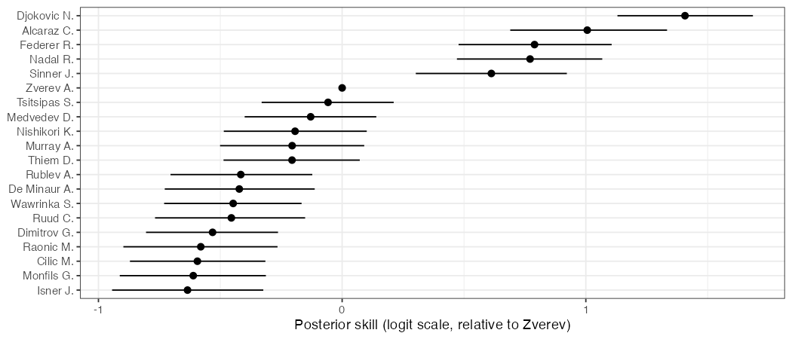
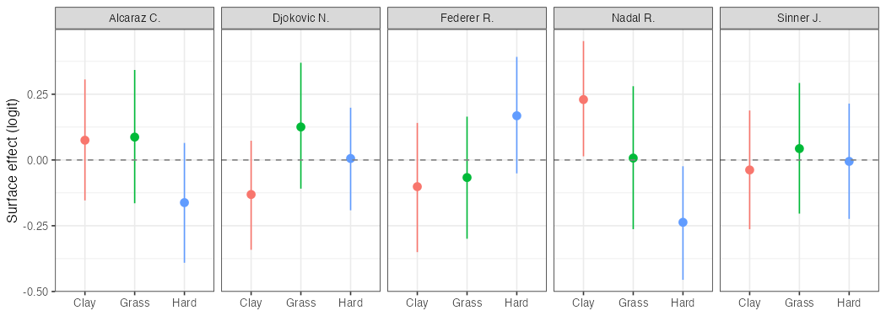
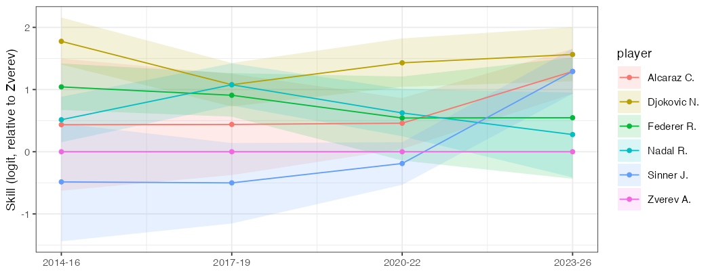
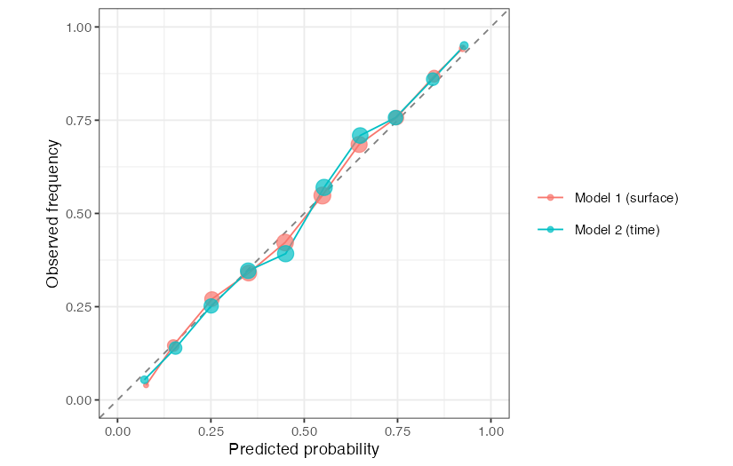

```{r setup, include=FALSE}
knitr::opts_chunk$set(
  echo = FALSE,
  warning = FALSE,
  message = FALSE,
  fig.align = "center",
  fig.pos = "H",
  out.width = "85%"
)
```

```{r libs}
library(dplyr)
library(readr)
library(tidyr)
library(lubridate)
library(ggplot2)
library(knitr)
library(loo)
```

# 1 Introduction

We study the problem of estimating latent tennis player skill from binary match outcomes using Bayesian inference. The core challenge is that player skill is **unobserved** — only win/loss results are recorded. Our goal is to infer player ability and evaluate whether additional model structure improves predictive performance.

This is a real-world inference problem in sports analytics, where ranking systems must account for uncertainty in player performance. We model pairwise match outcomes using latent skill parameters and investigate extensions incorporating surface effects and time-varying ability. Our research questions are: (1) can a Bayesian latent-skill model recover meaningful rankings? (2) do surface-specific skill effects improve calibration? (3) does time-varying skill?

# 2 Data

We use the [ATP Tennis Dataset](https://www.kaggle.com/datasets/dissfya/atp-tennis-2000-2023daily-pull) covering 2000–2026. Under the Bradley–Terry framework a match reduces to a binary outcome, so we retain only winner, loser, court surface, and year. Fitting the full dataset (67,000+ matches across 1,000+ unique players) would result in an extremely sparse observation matrix: most pairs of players have never met, which leads to weakly identified posterior distributions for most players. We address this by restricting to matches from 2014 onwards and to the 50 most active players by total match count, yielding ~4,500 matches across Hard, Clay, and Grass (Carpet was phased out of the ATP tour before 2014). Restricting to well-observed players ensures that each player's $\beta_i$ is identified by a meaningful number of match outcomes.

Full data wrangling, EDA, Stan code, and R scripts are in the [Github repository](https://github.com/jsuhenda/bayesian-tennis-model.git).

# 3 Literature Review

The Bradley-Terry model (Bradley & Terry, 1952) is a standard framework for modeling pairwise comparisons and forms the basis of many sports ranking systems. In this model, the probability that player $i$ defeats player $j$ depends only on the difference in their latent skill parameters, linked through the logistic function. Extensions of Bradley-Terry to a Bayesian setting have a long history in the sports analytics literature. Glickman (1999) introduced a Bayesian Elo analogue updating player strengths after each match; Herbrich et al. (2006) extended this to multiplayer settings via expectation propagation (TrueSkill).

In tennis specifically, it is well known that player performance depends strongly on court surface. Players often exhibit surface preferences due to differences in playing style and physical conditions. A well-known example is Rafael Nadal, whose performance on clay courts is substantially stronger than on other surfaces. Baker & McHale (2014) applied a paired-comparison model to ATP data and found significant surface-specific components in player skill. This motivates extending the baseline model to include surface-specific skill effects.

# 4 Model Specification

**Baseline Bradley–Terry.** Each player $i$ has latent skill $\beta_i \in \mathbb{R}$. For a match between $i$ and $j$:
$$Y_{ij} \mid \beta \sim \text{Bernoulli}(p_{ij}), \quad \text{logit}(p_{ij}) = \beta_i - \beta_j.$$
We fix $\beta_{\text{Zverev}} = 0$ as the reference player for identifiability and place $\beta_i \sim \mathcal{N}(0, 9)$ on remaining players. Zverev is chosen as a consistently active player across the full 2014–2026 period, giving a stable anchor across all four time periods. The choice $\sigma = 3$ allows skill differences up to 3 (win probabilities >95%) as plausible but not typical.

**Model 1: Surface-specific skill.** Each player gets a surface adjustment $\gamma_{i,s}$ for $s \in \{\text{Hard, Clay, Grass}\}$:
$$\text{logit}(p_{ij,s}) = (\beta_i + \gamma_{i,s}) - (\beta_j + \gamma_{j,s}).$$
We impose $\sum_s \gamma_{i,s} = 0$ per player for identifiability, with hierarchical prior $\gamma_{i,s} \sim \mathcal{N}(0, \tau_\gamma^2)$, $\tau_\gamma \sim \text{HalfNormal}(1)$. The shared $\tau_\gamma$ regularises surface effects when data are sparse. Total: 150 surface + 49 skill parameters.

**Model 2: Time-varying skill.** We aggregate seasons into four 3-year periods (2014–16, 2017–19, 2020–22, 2023–26) and let skill evolve as a random walk:
$$\beta_{i,t} = \beta_{i,t-1} + \varepsilon_{i,t}, \; \varepsilon_{i,t} \sim \mathcal{N}(0, \tau^2), \; \tau \sim \text{HalfNormal}(0.5),$$
with $\beta_{i,1} \sim \mathcal{N}(0, 9)$ and $\beta_{1,t} = 0$ for all $t$. Total: 196 skill parameters.

Stan code for both models is in Appendix A.

# 5 Posterior Inference

## Method 1: SNIS via simPPLe (correctness check)

We fit baseline Bradley–Terry in simPPLe on a toy subset of 5 players and 30 matches. Note that SNIS is impractical on the full dataset (ESS collapses in high dimensions, the R implementation is slow), so we use it only to validate Stan.

Using Tsitsipas as the reference player ($\beta_{\text{Tsitsipas}} = 0$), SNIS recovers posterior mean skills of $+1.22$ for Djokovic and $-3.54$ for Dimitrov. The ordering is directionally correct --- Djokovic was the strongest player on the tour during this period and Dimitrov the weakest of the five. The magnitudes are somewhat exaggerated relative to long-run head-to-head frequencies, a known feature of SNIS with a weakly informative prior and only 30 observed matches --- the posterior is pulled aggressively by the particular matches sampled. Nonetheless, the directional correctness is sufficient to confirm the Stan likelihood is correctly coded, motivating the switch to HMC for the full dataset. ESS is $124/10{,}000$ giving RMSE $\approx 2/\sqrt{124} \approx 0.17$, reliable to one digit.

## Method 2: HMC in Stan

We fit both models using Stan's NUTS sampler (Hamiltonian Monte Carlo): 4 chains, 1,000 warmup + 2,000 sampling iterations (8,000 posterior draws). Diagnostics (trace plots, rank histograms, bulk-ESS) are clean for both models with zero divergent transitions and zero max-treedepth hits. Fitting code is in Appendix B.

# 6 Results
```{r fig-skill, fig.width=6, fig.height=2.5, fig.cap="Top 20 posterior mean skills with 80\\% CI (Model 1)."}

```
The posterior rankings align with expert consensus during this era: Djokovic on top, followed by Federer, Nadal, and the younger generation (Alcaraz, Sinner). Credible intervals are wider for younger players with shorter careers, reflecting genuine uncertainty from fewer observed matches.

```{r fig-surface, fig.width=6, fig.height=2.5, fig.cap="Surface effects for five notable players (Model 1). Positive values indicate above-baseline performance."}

```
Surface effects recover interpretable patterns: \textbf{Nadal} shows the textbook "King of Clay" profile, with a strongly positive clay effect and negative hard effect; \textbf{Federer} shows his strongest effect on hard courts, with negative effects on clay and grass (the latter is an artifact of the sum-to-zero identifiability constraint, forces his large positive hard effect to be offset despite his well-known strength on grass (he won 8 Wimbledon titles);  \textbf{Djokovic} shows a mild preference for grass over clay; \textbf{Alcaraz} and \textbf{Sinner} show small, imprecise effects, consistent with their shorter careers offering less surface-specific data.

```{r fig-time, fig.width=6, fig.height=2.5, fig.cap="Posterior mean skill over 3-year periods for selected players (Model 2) with 80\\% credible bands."}

```
Career trajectories, expressed as skill relative to Zverev, match historical narratives: \textbf{Djokovic} stays consistently above the pack; starts high before experiencing a decline in 2017-19 then continues upwards; \textbf{Federer} and \textbf{Nadal} decline steadily from earlier peaks as they age; \textbf{Sinner} rises sharply into 2023–26, reflecting his recent breakthrough on the tour; \textbf{Alcaraz} appears flat near $+0.5$ across periods, an artifact of the random-walk prior we discuss in Limitations.

```{r fig-calib, fig.width=5, fig.height=2.5, fig.cap="Reliability diagram for Model 1 and Model 2. Points on the diagonal indicate perfect calibration."}

```
Both models are **well-calibrated**: predicted probabilities closely track observed frequencies across the full 0–1 range, with both curves hugging the diagonal. The two models are nearly indistinguishable in calibration, suggesting that while surface effects and time-varying skill capture different aspects of player performance, neither meaningfully improves calibration over the other. This supports the validity of the Bayesian Bradley–Terry framework — posterior predicted probabilities can be interpreted at face value. Calibration code is in Appendix C.

# 7 Discussion

Our Bayesian framework recovers sensible player rankings, captures the surface heterogeneity documented in the tennis literature (Nadal on clay, Federer on hard), and produces career trajectories consistent with historical player arcs. Both extensions are well-calibrated but neither improves on the other, suggesting that at this scale, surface-specific skill and time-varying skill encode comparable amounts of predictive information through different structural assumptions.

\textbf{Limitations.} 
We discard set and game scores, which carry information about margin of victory beyond the binary win/loss outcome. Restricting to 50 players introduces selection bias, and players with short pre-2014 careers (Alcaraz, Sinner) have fewer training observations, which manifests as wider credible intervals. The Bradley-Terry framework assumes match independence, so momentum and head-to-head dynamics are not captured. A joint surface-and-time model would be a natural next step but adds substantial parameters and risks non-identifiability without further regularisation.

One notable limitation is a consequence of the random-walk prior: players with no pre-2021 matches (Alcaraz, Sinner) receive backward-propagated skill estimates in early periods. Because Alcaraz sits around $+0.5$ above Zverev in 2023-26, the model infers his 2014-16 skill was also around $+0.5$, up to drift $\tau$. This is unphysical — Alcaraz was 11 years old in 2014 — and reflects a limitation of the stationary random-walk assumption. A more realistic model would only activate a player's skill after their first observed match, which we leave to future work.

Finally, calibration here is assessed in-sample; an out-of-sample posterior predictive check would provide stronger validation.


\newpage

# Appendix A: Stan Code {.unnumbered}

## Model 1 — Surface Effects {.unnumbered}

```stan
data {
  int<lower=1> N; int<lower=1> P; int<lower=1> S;
  array[N] int winner; array[N] int loser; array[N] int surface;
}
parameters {
  vector[P-1] beta_raw;
  matrix[P, S] gamma_raw;
  real<lower=0> tau_gamma;
}
transformed parameters {
  vector[P] beta;
  beta[1] = 0; beta[2:P] = beta_raw;
  matrix[P, S] gamma;
  for (p in 1:P) gamma[p,] = gamma_raw[p,] - mean(gamma_raw[p,]);
}
model {
  beta_raw ~ normal(0, 3);
  tau_gamma ~ normal(0, 1);
  to_vector(gamma_raw) ~ normal(0, tau_gamma);
  for (n in 1:N) {
    real lp = beta[winner[n]] + gamma[winner[n], surface[n]]
            - beta[loser[n]]  - gamma[loser[n],  surface[n]];
    1 ~ bernoulli_logit(lp);
  }
}
generated quantities {
  vector[N] p_pred;
  for (n in 1:N) {
    real lp = beta[winner[n]] + gamma[winner[n], surface[n]]
            - beta[loser[n]]  - gamma[loser[n],  surface[n]];
    p_pred[n] = inv_logit(lp);
  }
}
```

## Model 2 — Time-Varying Skill {.unnumbered}

```stan
data {
  int<lower=1> N; int<lower=1> P; int<lower=1> T;
  array[N] int winner; array[N] int loser; array[N] int period;
}
parameters {
  matrix[P-1, T] beta_raw;
  real<lower=0> tau;
}
transformed parameters {
  matrix[P, T] beta;
  beta[1,] = rep_row_vector(0, T);
  beta[2:P,] = beta_raw;
}
model {
  tau ~ normal(0, 0.5);
  beta_raw[,1] ~ normal(0, 3);
  for (t in 2:T) beta_raw[,t] ~ normal(beta_raw[,t-1], tau);
  for (n in 1:N) {
    1 ~ bernoulli_logit(beta[winner[n], period[n]] - beta[loser[n], period[n]]);
  }
}
generated quantities {
  vector[N] p_pred;
  for (n in 1:N) {
    real lp = beta[winner[n], period[n]] - beta[loser[n], period[n]];
    p_pred[n] = inv_logit(lp);
  }
}
```

# Appendix B: R Code — Fitting {.unnumbered}

## Data preparation for Stan (Zverev as reference) {.unnumbered}

```{r load-data, include=FALSE}
df_model <- read_csv("data/df_model.csv")

# Player and surface indexing — Zverev placed at index 1 as reference player
ref_player  <- "Zverev A."
others      <- sort(setdiff(union(df_model$winner_name, df_model$loser_name),
                             ref_player))
top_players <- c(ref_player, others)
player_ids  <- tibble(player = top_players, player_id = seq_along(top_players))
surface_ids <- tibble(surface = c("Hard", "Clay", "Grass"), surface_id = 1:3)

# 3-year period index for Model 2
df_model <- df_model %>%
  mutate(period = case_when(
    year >= 2014 & year <= 2016 ~ 1,
    year >= 2017 & year <= 2019 ~ 2,
    year >= 2020 & year <= 2022 ~ 3,
    year >= 2023              ~ 4
  ))

# Stan-ready data
df_stan <- df_model %>%
  left_join(player_ids, by = c("winner_name" = "player")) %>%
  rename(winner_id = player_id) %>%
  left_join(player_ids, by = c("loser_name" = "player")) %>%
  rename(loser_id = player_id) %>%
  left_join(surface_ids, by = "surface") %>%
  filter(!is.na(surface_id))

stan_data_m1 <- list(
  N = nrow(df_stan), P = length(top_players), S = 3,
  winner = df_stan$winner_id, loser = df_stan$loser_id,
  surface = df_stan$surface_id
)

stan_data_m2 <- list(
  N = nrow(df_stan), P = length(top_players), T = 4,
  winner = df_stan$winner_id, loser = df_stan$loser_id,
  period = df_stan$period
)
```

## SNIS via simPPLe (baseline, toy subset) {.unnumbered}

```{r snis-code, eval=FALSE, echo=TRUE}
source("utilities/simple.R")
source("utilities/simple_utils.R")
set.seed(405)

# Build a small real-data subset: 5 most active players, 30 sampled matches
toy_players <- df_model %>%
  pivot_longer(c(winner_name, loser_name), values_to = "player") %>%
  count(player, sort = TRUE) %>%
  slice(1:5) %>%
  pull(player)

# Put Tsitsipas S. at index 1 as reference for the toy model
ref_player <- "Tsitsipas S."
toy_players <- c(ref_player, setdiff(toy_players, ref_player))

toy_df <- df_model %>%
  filter(winner_name %in% toy_players,
         loser_name  %in% toy_players) %>%
  slice_sample(n = 30) %>%
  mutate(
    w_idx = match(winner_name, toy_players),
    l_idx = match(loser_name,  toy_players),
    i_idx = pmin(w_idx, l_idx),
    j_idx = pmax(w_idx, l_idx),
    toy_result = as.integer(w_idx == i_idx)
  )

i_idx       <- toy_df$i_idx
j_idx       <- toy_df$j_idx
toy_results <- toy_df$toy_result

# simPPLe model: player 1 fixed at beta = 0, infer beta_2..beta_5
bt_toy <- function() {
  beta <- c(0, simulate(Norm(0, 3)), simulate(Norm(0, 3)),
               simulate(Norm(0, 3)), simulate(Norm(0, 3)))
  for (k in seq_along(toy_results))
    observe(toy_results[k], Bern(plogis(beta[i_idx[k]] - beta[j_idx[k]])))
  return(beta[2])  # posterior of Djokovic relative to Tsitsipas
}
posterior(bt_toy, 10000)
ess(posterior_particles(bt_toy, 10000))
```

## HMC in Stan {.unnumbered}

```{r hmc-code, eval=FALSE, echo=TRUE}
library(cmdstanr)
mod_m1 <- cmdstan_model("stan/model1.stan")
mod_m2 <- cmdstan_model("stan/model2.stan")

fit_m1 <- mod_m1$sample(data = stan_data_m1, seed = 405, chains = 4,
  iter_warmup = 1000, iter_sampling = 2000, adapt_delta = 0.95)
fit_m2 <- mod_m2$sample(data = stan_data_m2, seed = 405, chains = 4,
  iter_warmup = 1000, iter_sampling = 2000, adapt_delta = 0.95)

fit_m1$save_object("fits/fit_m1.rds")
fit_m2$save_object("fits/fit_m2.rds")
```

# Appendix C: R Code — Results and Calibration {.unnumbered}

## Skill ranking, surface effects, and career trajectory plots {.unnumbered}

```{r plots-code, eval=FALSE, echo=TRUE}
# Posterior skill ranking (Model 1)
beta_df <- fit_m1$summary("beta", mean = mean, ~quantile(.x, c(0.1, 0.9))) %>%
  mutate(player_id = as.integer(gsub("beta\\[|\\]", "", variable))) %>%
  left_join(player_ids, by = "player_id") %>%
  arrange(desc(mean)) %>% slice(1:20)

p_skill <-
  ggplot(beta_df, aes(x = reorder(player, mean), y = mean,
                      ymin = `10%`, ymax = `90%`)) +
  geom_pointrange(size = 0.3) + coord_flip() +
  labs(x = NULL, y = "Posterior skill (logit scale, relative to Zverev)") +
  theme_bw(base_size = 9)

# Surface effects (Model 1)
gamma_df <- fit_m1$summary("gamma", mean = mean, ~quantile(.x, c(0.1, 0.9))) %>%
  mutate(idx = gsub("gamma\\[|\\]", "", variable),
         player_id = as.integer(sub(",.*", "", idx)),
         surf_id   = as.integer(sub(".*,", "", idx))) %>%
  left_join(player_ids, by = "player_id") %>%
  left_join(surface_ids, by = c("surf_id" = "surface_id")) %>%
  filter(player %in% c("Nadal R.", "Federer R.", "Djokovic N.",
                        "Alcaraz C.", "Sinner J."))

p_surface <-
  ggplot(gamma_df, aes(x = surface, y = mean, ymin = `10%`, ymax = `90%`,
                       color = surface)) +
  geom_pointrange(show.legend = FALSE) +
  geom_hline(yintercept = 0, linetype = "dashed", color = "gray50") +
  facet_wrap(~player, ncol = 5) +
  labs(x = NULL, y = "Surface effect (logit)") + theme_bw(base_size = 8)

# Career trajectories (Model 2)
period_labels <- c("2014-16", "2017-19", "2020-22", "2023-26")
beta_t_df <- fit_m2$summary("beta", mean = mean, ~quantile(.x, c(0.1, 0.9))) %>%
  mutate(idx = gsub("beta\\[|\\]", "", variable),
         player_id = as.integer(sub(",.*", "", idx)),
         period    = as.integer(sub(".*,", "", idx))) %>%
  left_join(player_ids, by = "player_id") %>%
  filter(player %in% c("Nadal R.", "Federer R.", "Djokovic N.",
                        "Alcaraz C.", "Sinner J.", "Zverev A."))

p_time <-
  ggplot(beta_t_df, aes(x = period, y = mean, ymin = `10%`, ymax = `90%`,
                        color = player, fill = player)) +
  geom_ribbon(alpha = 0.15, color = NA) + geom_line() + geom_point() +
  scale_x_continuous(breaks = 1:4, labels = period_labels) +
  labs(x = NULL, y = "Skill (logit, relative to Zverev)") +
  theme_bw(base_size = 9)

ggsave("figs/skill_ranking.png",       p_skill,   width = 7, height = 3,   dpi = 150)
ggsave("figs/surface_effects.png",     p_surface, width = 7, height = 2.5, dpi = 150)
ggsave("figs/career_trajectories.png", p_time,    width = 7, height = 2.7, dpi = 150)
```

## Calibration plot {.unnumbered}

```{r calib-code, eval=FALSE, echo=TRUE}
p_winner_m1 <- fit_m1$summary("p_pred")$mean
p_winner_m2 <- fit_m2$summary("p_pred")$mean

# Randomly reframe half the matches from loser's perspective so outcomes
# have both 0s and 1s (otherwise all p_pred correspond to outcome = 1)
set.seed(405)
flip <- rbinom(length(p_winner_m1), 1, 0.5)

calib_df <- bind_rows(
  tibble(p_pred = ifelse(flip == 1, 1 - p_winner_m1, p_winner_m1),
         outcome = ifelse(flip == 1, 0, 1), model = "Model 1 (surface)"),
  tibble(p_pred = ifelse(flip == 1, 1 - p_winner_m2, p_winner_m2),
         outcome = ifelse(flip == 1, 0, 1), model = "Model 2 (time)")
) %>%
  mutate(bin = cut(p_pred, breaks = seq(0, 1, 0.1), include.lowest = TRUE)) %>%
  group_by(model, bin) %>%
  summarise(mean_pred = mean(p_pred), mean_obs = mean(outcome),
            n = dplyr::n(), .groups = "drop")

p_calib <-
  ggplot(calib_df, aes(x = mean_pred, y = mean_obs, color = model)) +
  geom_abline(slope = 1, intercept = 0, linetype = "dashed", color = "gray50") +
  geom_line() + geom_point(aes(size = n), alpha = 0.7) +
  scale_size_continuous(range = c(1, 4), guide = "none") +
  coord_fixed(xlim = c(0, 1), ylim = c(0, 1)) +
  labs(x = "Predicted probability", y = "Observed frequency", color = NULL) +
  theme_bw(base_size = 9)

ggsave("figs/calibration.png", p_calib, width = 5.5, height = 3.5, dpi = 150)
```

## AI Acknowledgement {.unnumbered}

Claude (Anthropic) was used during this project to assist with debugging R and Stan code, generating visualization code (ggplot2 plotting of posterior summaries, surface effects, career trajectories, and the calibration reliability diagram), and troubleshooting errors encountered during model fitting and knitting. All modelling decisions, interpretations, and written content in this report are my own.

# References {.unnumbered}

Baker, R. D., & McHale, I. G. (2014). A dynamic paired comparisons model. *European J. Operational Research*, 236(2), 677–684.

Bradley, R. A., & Terry, M. E. (1952). Rank analysis of incomplete block designs. *Biometrika*, 39(3–4), 324–345.

Glickman, M. E. (1999). Parameter estimation in large dynamic paired comparison experiments. *J. Royal Statistical Society C*, 48(3), 377–394.

Herbrich, R., Minka, T., & Graepel, T. (2006). TrueSkill: A Bayesian skill rating system. *NeurIPS*, 19.

